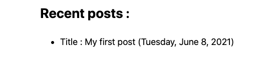

# Static Site Generation with  `getStaticProps`


- Export with page : 

  ```javascript
  export default function Home(props) { ... }
  
  export async function getStaticProps() {
    const data = require('fs').readFileSync("../../config.json");
  
    // "props" passed as value to component
    return {
      props: ...
    }
  }
  ```

  

### Setup build time props

- Update `pages/index.js` to export the `getStaticProps`

  ```javascript
  export async function getStaticProps() {
    return new Promise(resolve => {
      const posts = [
        {
          title: 'My first post', 
          id: 'my-first-post', 
          date: new Date(2021, 5, 8).toISOString()
        }
      ];
  
      resolve({props: {posts}});
    });
  }
  ```


- Modify the home component: 

  ```react
  <section>
    <h2>Recent posts : </h2>
    <ul>
      {props.posts.map(post => {
        return (
          <li key={post.id}>
            Title : {post.title} ({post.date})
          </li>
        );
      })}
    </ul>
  </section>
  ```


- Now open homepage at 

  

