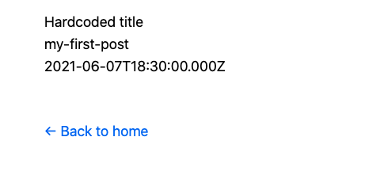

# Create Page and Routes

>  **Dynamic Routes**: Pages that begin and end with `[` and `]` are dynamic routes (`pages/[page-id].js`)
>
> So now we have created a dynaimc route `posts/:id`


- Create dynamic routes by creating file  `pages/posts/[id].js`

  

- Use `getStaticPaths` to create a list of paths in `pages/posts/[id].js`

  ```javascript
  export async function getStaticPaths() {
    return {
      fallback:false,
      paths:[
        {
          params:{id:'my-first-post'}
        }], 
    };
  }
  ```

  > This means that there is only one possible value for this route.
  >
  > `fallback: false` means that any value not matched with the static paths will return error at runtime.


-  to get page data when a post-id is loaded ( https://nextjs.org/docs/basic-features/data-fetching#the-paths-key-required)

  ```javascript
  export async function getStaticProps({ params }) {
  
    const postData = {
      title: 'Hardcoded title',
      id: params.id,
      date: new Date(2021, 5, 8).toISOString()
    };
  
    return {
      props: {
        postData
      }
    }
  }
  ```


- Render a post 

  ```javascript
  export default function Post({ postData }) {
    return (
      <Layout>
        {postData.title}
        <br />
        {postData.id}
        <br />
        {postData.date}
      </Layout>
    )
  }
  ```


- Now open http://localhost:3000/posts/my-first-post

  

- Get actual files data in `lib/posts.js`

  ```javascript
  
  export function getAllPostIds() {
    const fileNames = fs.readdirSync(postsDirectory)
    return fileNames.map(fileName => {
      return {
        params: {
          id: fileName.replace(/\.md$/, '')
        }
      }
    })
  }
  
  export function getPostData(id) {
    const fullPath = path.join(postsDirectory, `${id}.md`)
    const fileContents = fs.readFileSync(fullPath, 'utf8')
  
    // Use gray-matter to parse the post metadata section
    const matterResult = matter(fileContents)
  
    // Combine the data with the id
    return {
      id,
      ...matterResult.data
    }
  }
  
  ```


- Use this actual data in `pages/posts/[id].js`

  ```javascript
  import { getAllPostIds, getPostData } from '../../lib/posts'
  
  export async function getStaticPaths() {
    const paths = getAllPostIds();
    return {
      paths,
      fallback: false
    };
  }
  
  export async function getStaticProps({params}) {
    const postData = getPostData(params.id);
    return {
      props: {postData},
    };
  }
  
  ```

  


Source : 

- path : https://nextjs.org/docs/basic-features/data-fetching#the-paths-key-required
- Dynamic routes : https://nextjs.org/learn/basics/dynamic-routes