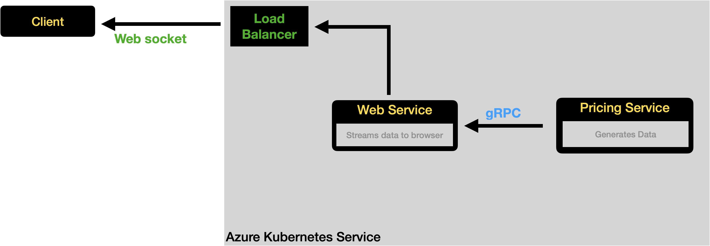
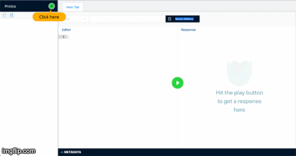
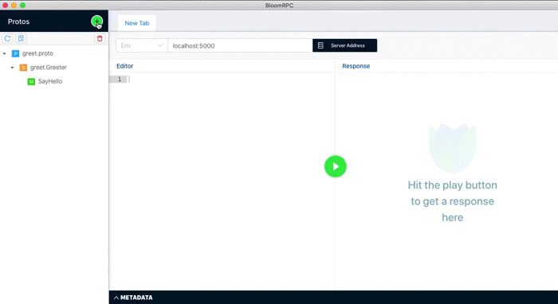
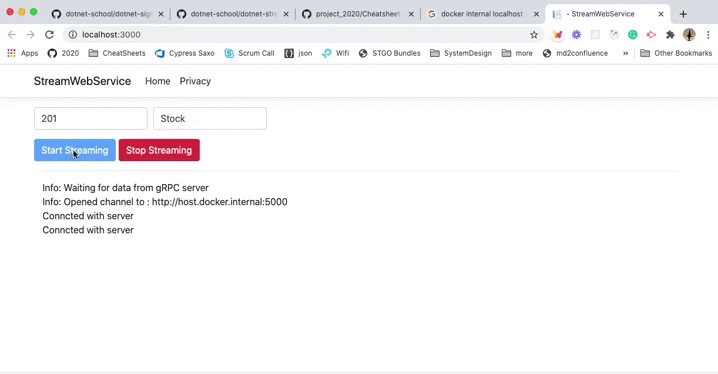
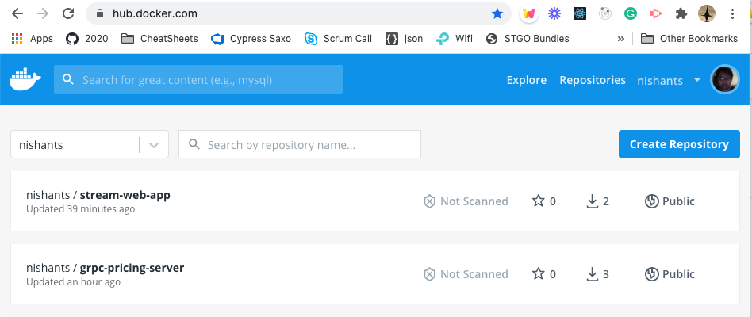
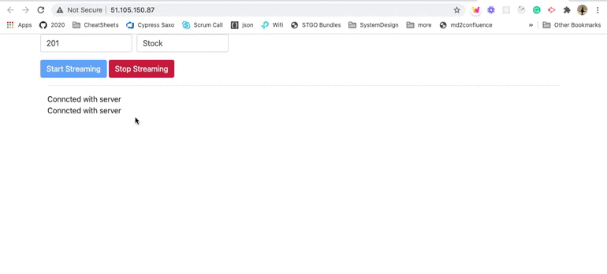

In this workshop we will create a grpc streaming server, consume it using a web service. We will use 

- Dot net Core 3.1
- Docker
- gRPC
- SignalR
- Minikube
- Azure CLI
- Azure Kubernetes Service




This will be helpful for anyone who is just getting started with gRPC in a new project. It assumes basic knowledge of Docker, Kubernetes, C#, Dotnet core. 

If you are complete beginner to above, please consider doing below exercises first : 

- Docker exercise : https://github.com/dotnet-school/dotnet-docker
- Kubernetes exercise : https://github.com/dotnet-school/dotnet-k8
- AKS exervices : https://github.com/dotnet-school/dotnet-aks


**This is a purely handson workshop and does not talk about gRPC or protobuf in depth.**


### Contents

- **[Pre-requisites](#pre-requisites)**

  > *Shell, Dot Net Core 3.1, BloomRPC, Docker*

- **[Create a gRPC service](#create-service)**

  > *Create service using `dotnet new grpc`*

- **[Test gRPC service](#test-service)**

  > *Test a gRPC endpoint using BloomRPC*

- **[Create gRPC client](#create-client)**

  > *Create a console app using `dotnet new console` and get response from a gRPC endpoint*

- **[Create gRPC streaming endpoint](#create-stream)**

  > *Add streaming endpoint to our grpc server*
  
- **[Create gRPC streaming client](#create-stream-client)**

  > *Consume our streaming endpoint in the client*
  
- **[Create a streaming web app](#create-stream-webapp)**

  > *Create a streaming web app with SIgnalR*

- **[Consume gRPC service in our web app](#add-grpc-client-to-webapp)**

  > *Consume data from gRPC server in the webapp and stream to end client*
  
- **[Containerize web app](#containerize-web-app)**

  > *Run our web streaming service as a docker container*

- **[Create kubernetes configuration](#create-k8s-config)**

  > *Create kuberntes configuration for our app and services*

- **[Deploy app on Azure Kubernetes Service](#deploy-on-aks)**

  > *Create a cluster on Azure Kubernetes Service using Azure CLI and deploy app on cloud.*

  

<a name="pre-requisites"></a>

### Pre-requisites

- **Shell** 

  All commands are written for bash on MacOS, but you can use them in a **GitBash** or **Powershell**. We have used CLI instead of Visual Studio as it gives better view of what is going on underneath.

- **DotNet Core 3.1**

  We have used 3.1 as DotNet 5 is still in beta. Though everything should work the same with 5. If it does not, please help us all by reporting it.

- **BloomRPC**

  Download from here : https://appimage.github.io/BloomRPC/. We use it to tests our gRPC server, before we start writting a client ourselves.

- **Docker**

- **Minikube** 

- **Azure  Account**

- **Azure CLI**


<a name="create-service"></a>

# Step1 - Creating a gRPC service

```bash
# Create a folder for our project
mkdir dotnet-docker-grpc-stream

# Create a new project names as Service
dotnet new grpc -o Service

# Generate a gitignore file
dotnet new gitignore

# Start our server
cd Service
dotnet run

# Commit your code
git add --all
git commit -m "Created a web service"
```

>  If you are using MacOS, you will get error. Kestrel doesn't support HTTP/2 with TLS on macOS and older Windows versions such as Windows 7.
>
> You will be able to run the server after next step in which we will run service inside docker container.
>
> If you still want to fix this, read  https://docs.microsoft.com/en-us/aspnet/core/grpc/troubleshoot?view=aspnetcore-3.1#unable-to-start-aspnet-core-grpc-app-on-macos


**Create a file `Service/Dockerfile`**

```dockerfile
# Service/Dockerfile

FROM mcr.microsoft.com/dotnet/core/sdk:3.1 AS build
WORKDIR /source

COPY ./*.csproj .
RUN dotnet restore

COPY . .
RUN dotnet publish -c release -o /app --no-restore

FROM mcr.microsoft.com/dotnet/core/aspnet:3.1
WORKDIR /app

COPY --from=build /app .

EXPOSE 80  
ENTRYPOINT ["dotnet", "Service.dll"]
```

Create another file `Service/.dockerignore` to tell docker which files to ignore

```bash
# Service/.dockerignore

**/.dockerignore
**/.project
**/.vs
**/.idea
**/.vscode
**/*.*proj.user
**/bin
**/Dockerfile*
**/obj
```

Now run the server as docker container: 

```bash
# Build docker image
docker build -t server .

# Run service as container
docker run -p 5000:80 server
```

Checkout a protobuf created at `dotnet-docker-grpc-stream/Service/Protos/greep.proto`. We will use it in next step to test our server.


<a name="test-service"></a>

# Step 2 - Testing a gRPC endpoint 

Just like we can use postman to test an HTTP endpoint, we will use [BloomRPC](https://appimage.github.io/BloomRPC/.) to test our gRPC endpoint.

Download and open the app from [here](https://appimage.github.io/BloomRPC). 




<a name="create-client"></a>


# Step - 3 Create a client app

In this step we will create a .netcore console app and hit our server to read from gRPC endpoint.

Create a console app in the root directory of our project

```bash
# Go to our project's root (assuming you are in Service directory)
cd ../
dotnet new console -o Client
```


We need following libraries to make our client work : 

- [Grpc.Net.Client](https://www.nuget.org/packages/Grpc.Net.Client), which contains the .NET Core client.
- [Google.Protobuf](https://www.nuget.org/packages/Google.Protobuf/), which contains protobuf message APIs for C#.
- [Grpc.Tools](https://www.nuget.org/packages/Grpc.Tools/), which contains C# tooling support for protobuf files. The tooling package isn't required at runtime, so the dependency is marked with `PrivateAssets="All"`.

```bash
dotnet add package Grpc.Net.Client
dotnet add package Google.Protobuf
dotnet add package Grpc.Tools
```


Add the proto files from our server to client project at `Client/Protos/greet.proto`

```bash
mkdir Protos
cp ../Service/Protos/greet.proto ./Protos/
```


Modify the `Client/Client.csproj` file to add reference to the proto file

```xml
<ItemGroup>
  <Protobuf Include="Protos\greet.proto" GrpcServices="Client" />
</ItemGroup>
```


Now create the Program.cs as 

```csharp
using System;
using System.Threading.Tasks;
using Grpc.Net.Client;
using Service;

namespace Client
{
  class Program
  {
    static void Main()
    {
      // Ignore this for now
      AppContext.SetSwitch(
        "System.Net.Http.SocketsHttpHandler.Http2UnencryptedSupport", true);
      
      SayHello();
    }

    private static void SayHello()
    {
      using var channel = GrpcChannel.ForAddress("http://localhost:5000");
      
      // Greeter service is defined in hello.proto
      // <service-name>.<service-name>Client is auto-created
      var client = new Greeter.GreeterClient(channel);
      
      // HelloRequest is defined in hello.proto
      var request = new HelloRequest();
      request.Name = "Nishant";
      
      // SayHello method is defined in hello.proto
      var response = client.SayHello(request);
      
      // HelloResponse.Message is defined in hello.proto
      Console.WriteLine(response.Message);
    }
  }
}
```


```bash
# Run the server if not already running
docker run -p 5000:80 server

# Run client (in Client dir)
dotnet run
```


<a name="create-stream"></a>

# Step 4 - Create a streaming endpoint

Now we will create a protobuf file for an streaming interface and take a look at the protobuf syntax.

We will create a server that can take a financial instrument and stream its price in real time.


### Define protobuf

It is very much like defining a class in C#. Though there is one big difference that there is a number associated with each field in message. **This number is used to identify field in binary message data.** Unlike REST, the messages in gRPC are sent and received in binary. Which makes is much more efficient.

Create our `prices.proto` file in `Server/Protos/prices.proto`: 

```protobuf
// Server/Protos/prices.proto

syntax = "proto3";
package prices;

// Code will be generated in this namespace
option csharp_namespace = "Service";

// The gRPC interface definition
service Pricing {
  // Note that it returns "stream" of PriceResponse
  rpc Subscribe (PriceRequest) returns (stream PriceResponse);
}

// The request message
message PriceRequest {
  string uic = 1;
  string assetType = 2;
}

// The response message
message PriceResponse {
  string quote = 1;
}
```

Take a note of returns statement here. **The return type is a stream of PriceResponse instead of a single instance of PriceResponse.**

Here we define the interface for our service. It is very much like an interface in C#. This interface is known by both client and server. The nugets on client and server generate code based on this protobuf file.


Now we will include the file in our `Service/Service.csproj`.

```xml
<!-- Service/Service.csproj --> 

<ItemGroup>
  <Protobuf Include="Protos\greet.proto" GrpcServices="Server" />
  <Protobuf Include="Protos\prices.proto" GrpcServices="Server"/>
</ItemGroup>
```

Notice that it already has a `greet.proto`  defined that was created by default and that we used in first part of the workshop.


**Create implementation of the endpoint**

Create file `Services/PricingService.cs `:

```csharp
using System;
using System.Threading.Tasks;
using Grpc.Core;

namespace Service
{
  // Pricing is the name or interface in prices.proto
  // <service-name>.<service-name>Base class is auto generated
  public class PricingService : Pricing.PricingBase
  {

    public override async Task Subscribe(
      PriceRequest request, 
      IServerStreamWriter<PriceResponse> responseStream, 
      ServerCallContext context
    ){
      var i = 0;
      while (true)
      {
        // At every second, keep sending a fake response
        await Task.Delay(TimeSpan.FromSeconds(1));
        var quote = $"Quote#{++i} for {request.Uic}-{request.AssetType}";
        Console.WriteLine($"Sent: {quote}");
        var response = new PriceResponse{Quote = quote};
        await responseStream.WriteAsync(response);
      }
    }
  }
}
```


Now register our  **PricingService** in `Startup.cs`

```diff
 app.UseEndpoints(endpoints =>{
   endpoints.MapGrpcService<GreeterService>();
+  endpoints.MapGrpcService<PricingService>();
}
```

Notice that the GreeterService was created by default with the project.


Now lets build and run our service as docker image: 

```bash
docker build -t server .
docker run -p 5000:80 server
```


Now in BloomRPC, click on **+** icon and add our `Service/Protos/prices.proto`




<a name="create-stream-client"></a>

# Step 5 : Create streaming client

Now that our server has an streaming endpoint, lets create a client code that can listen to the stream.

Copy the `Service/Protos/prices.proto` to `Client/Protos/prices.proto`

```bash
cd Client
cp ../Service/Protos/prices.proto ./Protos/
```

Remember we can not consume a gRPC endpoint unless we have the proto file for the interface.

Add the `prices.proto` to `Client/Client.csproj`

```diff
 <ItemGroup>
	 <Protobuf Include="Protos\greet.proto" GrpcServices="Client" />
+	 <Protobuf Include="Protos\prices.proto" GrpcServices="Client" />
 </ItemGroup>
```


Add another method in our 

```csharp
private static async Task SubscribeToStream()
{
  using var channel = GrpcChannel.ForAddress("http://localhost:5000");

  var client = new Pricing.PricingClient(channel);
  var request = new PriceRequest{Uic = "211", AssetType = "Stock"};

  var streamReader = client.Subscribe(request).ResponseStream;

  while (await streamReader.MoveNext())
  {
    Console.WriteLine($"Received: {streamReader.Current}");
  }

  Console.WriteLine("Gracefully ended.");
}
```

Now call this method in main function  : 

```diff
- static void Main()
+ static async Task Main()
 {
   AppContext.SetSwitch(
     "System.Net.Http.SocketsHttpHandler.Http2UnencryptedSupport", 
     true);

   SayHello();
+  await SubscribeToStream();
 }
```

And add this import on top:

```diff
using Grpc.Net.Client;
```

Now lets test our client

```bash
# Run the server if not running
docker run -p 5000:80 server

# Run client (in Client dir)
dotnet run
```

Expected output : 

```yaml
Received: { "quote": "Quote#1 for 211-Stock" }
Received: { "quote": "Quote#2 for 211-Stock" }
Received: { "quote": "Quote#3 for 211-Stock" }
Received: { "quote": "Quote#4 for 211-Stock" }
```

Our gRPC streaming client server is working. You should keep seeing new message on console till you kill the client.


<a name="create-stream-webapp"></a>

# Step 6 - Create a streaming web server

In this part we will create a webserver that will have a html page and will stream data to client.

For now we will just stream some randon data before we make it consume our gRPC service.


Create streaming web service

```bash
# Creat a webapp for streaming to client
dotnet new webapp -o StreamWebService

cd StreamWebService

# Create dockerignore for the project
dotnet new gitignore

# Run the app (make sure gRPC server is not running at 5000)
dotnet run
```


Now open open http://localhost:5000/ and check app


In `StreamWebService/Startup.cs`, initialize SignalR on server side by adding this to `ConfigureServices`

```diff
	public void ConfigureServices(IServiceCollection services)
	{
		services.AddRazorPages();
+		services.AddSignalR();
	}
```


Create a file `StreamWebService/PricingHub.cs`:

```csharp
using System;
using System.Collections.Generic;
using System.Runtime.CompilerServices;
using System.Threading;
using System.Threading.Tasks;
using Microsoft.AspNetCore.SignalR;

namespace StreamWebService
{
  public class PricingHub : Hub
  {
    
    public async IAsyncEnumerable<string> Subscribe(
            string uic,
            string assetType,
            [EnumeratorCancellation]
            CancellationToken cancellationToken)
    {
      for (var i = 0; i < 10; i++)
      {
        // Check the cancellation token regularly so that the server will stop
        // producing items if the client disconnects.
        cancellationToken.ThrowIfCancellationRequested();

        yield return $"{i} : {uic}-{assetType}";

        // Use the cancellationToken in other APIs that accept cancellation
        // tokens so the cancellation can flow down to them.
        await Task.Delay(TimeSpan.FromSeconds(1), cancellationToken);
      }
    }
  }
}
```

Not add the PricingHub to endoints in ``StreamWebService/Startup.cs`

```diff
  app.UseEndpoints(endpoints =>
  {
  	endpoints.MapRazorPages();
+  	endpoints.MapHub<PricingHub>("/subscribe/infoprice");
  });
```

Add SignalR client side library with libman

```bash
# Install libman
dotnet tool install -g Microsoft.Web.LibraryManager.Cli

# Add SignalR client using libman
libman install @microsoft/signalr@latest -p unpkg -d wwwroot/js/signalr --files dist/browser/signalr.js --files dist/browser/signalr.min.js
# wwwroot/js/signalr/dist/browser/signalr.js written to disk
# wwwroot/js/signalr/dist/browser/signalr.min.js written to disk
# Installed library "@microsoft/signalr@latest" to "wwwroot/js/signalr"
```

Edit `Pages\Index.cshtml`

```xml
@page
<div class="container">
    <div class="row">
        <form>
            <div class="form-row">
                <div class="form-group col-md-6">
                    <input type="text" 
                           id="uic" class="form-control" 
                           placeholder="uic"/>
                </div>
                <div class="form-group col-md-6">
                    <input class="form-control" 
                           type="text" 
                           id="assetType" 
                           placeholder="Asset Type"/>
                </div>
            </div>
            <button type="button" 
                    id="startStreaming" 
                    class="btn btn-primary" 
                    disabled="true">Start Streaming</button>
        </form>
    </div>
    <hr/>
    <div class="row">
        <div class="col-6">
            <ul id="messagesList" style="list-style: none; padding:  0; margin:  0"></ul>
        </div>
    </div>
</div>

<script src="~/js/signalr/dist/browser/signalr.js"></script>
<script src="~/js/pricing.js"></script>
<link rel="stylesheet" href="https://stackpath.bootstrapcdn.com/bootstrap/4.5.2/css/bootstrap.min.css">
```

Create file `StreamWebService/wwwroot/js/pricing.js`

```javascript
// wwwroot/js/pricing.js
"use strict";

const pricingConnection = new signalR.HubConnectionBuilder()
    .withUrl("/subscribe/infoprice")
    .build();

const showMessage = (content) => {
    var li = document.createElement("li");
    li.textContent = content;
    document.getElementById("messagesList").prepend(li);
};

const setButtonEnabled = status => 
    document.getElementById("startStreaming").disabled = !status;

pricingConnection.start().then( ()=> {
    setButtonEnabled(true);
    showMessage("Conncted with server");
}).catch((err) => {
    showMessage("Failed to connect to server" + err.toString());
});

document
    .getElementById("startStreaming")
    .addEventListener("click", () => {
        setButtonEnabled(false);
        const uic = document.getElementById("uic").value;
        const assetType = document.getElementById("assetType").value;

        pricingConnection.stream("Subscribe", uic, assetType)
            .subscribe({
                next: showMessage,
                complete: () => {
                    showMessage("Stream completed");
                    setButtonEnabled(true);
                },
                error: showMessage,
            });
        event.preventDefault();
    });
```


<a name="add-grpc-client-to-webapp"></a>

# Step 6 - Add gRPC Client to webapp

This step is almost same as the *[Create gRPC client](#create-client)* step. Instead of a console app, this time we will add gRPC client to a web app.

Add required nugets: 

```bash
dotnet add package Grpc.Net.Client
dotnet add package Google.Protobuf
dotnet add package Grpc.Tools
```

Add the proto files from our server to this project at `StreamWebService/Protos/prices.proto`

```bash
mkdir Protos
cp ../Service/Protos/prices.proto ./Protos/
```

Add `prices.proto` to out `StreamWebService/StreamWebService.csproj`

```xml
  <ItemGroup>
    <Protobuf Include="Protos\prices.proto" GrpcServices="Client" />
  </ItemGroup>
```

Update `StreamWebService/Program.cs` : 

```diff
  public static void Main(string[] args)
  {
+   AppContext.SetSwitch(
+    "System.Net.Http.SocketsHttpHandler.Http2UnencryptedSupport", 
+   	true
+   );
    CreateHostBuilder(args).Build().Run();
  }
```

This is required as our gRPC server serves on HTTP port, so lets enable insecure HTTP2 support (gRPC uses HTTP2 under the hood).


Update `StreamWebService/PricingHub.cs` to stream data from our gRPC service : 

```csharp
using System;
using System.Collections.Generic;
using System.Runtime.CompilerServices;
using System.Threading;
using Grpc.Core;
using Grpc.Net.Client;
using Microsoft.AspNetCore.SignalR;
using Service;

namespace StreamWebService
{
  public class PricingHub : Hub
  {
    
    public async IAsyncEnumerable<string> Subscribe(
            string uic,
            string assetType,
            [EnumeratorCancellation]
            CancellationToken cancellationToken)
    {
      var url = "http://localhost:5000";
      using var channel = GrpcChannel.ForAddress(url);
      
      yield return $"Info: Openening channel to : {url}";

      var client = new Pricing.PricingClient(channel);
      var request = new PriceRequest{Uic = uic, AssetType = assetType};
      
      var streamReader = client.Subscribe(request).ResponseStream;

      yield return "Info: Invoking stream..";

      while (await streamReader.MoveNext())
      {
        cancellationToken.ThrowIfCancellationRequested();
        yield return $"Data: {streamReader.Current}";
      }

      Console.WriteLine("Gracefully ended.");
    }
  }
}
```


Now lets consume the gRPC streaming endpoint server in webapp

```bash
# Run the server on 5000
docker run -p 5000:80 server

# Run on port 300 (in StreamWebService dir)
dotnet run --urls=http://localhost:3000/
```

Open http://localhost:3000/ to check our page.



<a name="containerize-web-app"></a>

# Step 7 - Run web app as container

Before we containerize our web app, we need to make sure we can pass the url to gRPC endpoint as a runtime variable.

Edit the `StreamWebService/PricingHub.cs`

```diff
- var url = "http://localhost:5000";
+ var url = Environment.GetEnvironmentVariable("PRICING_STREAM_ENDPOINT");
  using var channel = GrpcChannel.ForAddress(url);
```


Create a file `StreamWebService/Dockerfile`

```dockerfile
#StreamWebService/Dockerfile

FROM mcr.microsoft.com/dotnet/core/sdk:3.1 AS build
WORKDIR /source

COPY ./*.csproj .
RUN dotnet restore

COPY . .
RUN dotnet publish -c release -o /app --no-restore

FROM mcr.microsoft.com/dotnet/core/aspnet:3.1
WORKDIR /app

COPY --from=build /app .

EXPOSE 80  
ENTRYPOINT ["dotnet", "StreamWebService.dll"]
```


Create `StreamWebService/.dockerignore`

```
**/.dockerignore
**/.project
**/.vs
**/.idea
**/.vscode
**/*.*proj.user
**/bin
**/Dockerfile*
**/obj
```

Run gRPC server and web app as docker containers

```bash
# Build docker container for web service (in StreamWebService dir)
docker build -t stream-web-app .

# Run the server on 5000 (if not already running)
docker run -p 5000:80 server

# Run on port 300 
docker run -p 3000:80 -e PRICING_STREAM_ENDPOINT="http://host.docker.internal:5000" stream-web-app

```

Open http://localhost:3000/ to check our page.


<a name="create-k8s-config"></a>

# Step 8 - Create Kubernetes defintion

Before creating our kuberntes configuration, we will push our docker images to docker hub.

```bash
docker login

# User your own username instead of nishants
docker tag server:latest nishants/grpc-pricing-server:v0.1 
docker push nishants/grpc-pricing-server:v0.1 

# User your own username instead of nishants
docker tag stream-web-app:latest nishants/stream-web-app:v0.1 
docker push nishants/stream-web-app:v0.1 
```


Open docker hub and make sure your image is publicly accessible:




Create a `StreamWebService/k8s/web.yml`

```yaml
# This part creates a load balancer pod that receives traffic from
# internet and load-balances to our pods
apiVersion: v1
kind: Service
metadata:
  name: stream-web-app-service
spec:
  selector:
    app: stream-web-app     # This makes load balancer point to stream-web-app deployment
  ports:
    - port: 80        
      targetPort: 80  # The port our container(in pods) listens to
  type: LoadBalancer
---
# This part creates a pod that runs our docker image
apiVersion: apps/v1
kind: Deployment
metadata:
  name: stream-web-app
spec:
  # Keep two replicas of our app
  replicas: 2  
  selector:
    matchLabels:
      app: stream-web-app
  template:
    metadata:
      labels:
        app: stream-web-app
    spec:
      containers:
        - name: stream-web-app
          image: nishants/stream-web-app:v0.1  # Our docker image on docker hub
          ports:
            - containerPort: 80           # Port that our app listens to
          env:
            - name: PRICING_STREAM_ENDPOINT
              value: http://pricing-grpc-service:5000
          imagePullPolicy: Always
```

Now we will create a kuberntes cluster locally to test our manifest file. You can use minikube or kind for this.

```bash
# Start a single node cluster locally
minikube start

# Check our local cluster
kubectl cluster-info

# Deploy our service to local cluster
kubectl apply -f StreamWebService/k8s/web.yml
# service/stream-web-app-service created
# deployment.apps/stream-web-app created

# Check our service in browser
minkube service stream-web-app-service
```

Our service will fail to connect to gRPC server, even if gRPC service is running as docker container. We will need to deploy our gRPC server in the kuberntes cluter.


Create a `Service/k8s/pricing-service.yml`

```yaml
apiVersion: v1
kind: Service
metadata:
  name: pricing-grpc-service   # Name of service (we use this as domain in todo-app config)
spec:
  selector:
    app: pricing-grpc       # Exposes stream-web-app as service
  ports:
    - port: 5000
      targetPort: 80 # Map service port to container port
---
apiVersion: apps/v1
kind: Deployment
metadata:
  name: pricing-deployment     # Name of deployment, we wil refer this in service
spec:
  replicas: 2  
  selector:
    matchLabels:
      app: pricing-grpc
  template:
    metadata:
      labels:
        app: pricing-grpc
    spec:
      containers:
        - name: pricing-grpc
          image: nishants/grpc-pricing-server:v0.1   # Image name for stream-web-app container
          ports:
            - containerPort: 80
```


Deploy our gRPC server in kubernetes cluster

```bash
kubectl apply -f Service/k8s/pricing-service.yml

# Check our service in browser
minkube service stream-web-app-service
```

This time our service should be able to get data from gRPC service.


<a name="deploy-on-aks"></a>

# Step 9 - Deploy app on Azure Kubernetes Service


Login to Azure CLI and create a Kubernetes cluster

```bash
# login using azure cli
az login

RESOURCE_GROUP=pricing-streaming-demo
CLUSTER_NAME=pricing-streaming-demo
REGION=westeurope

# Create resource
az group create --name $RESOURCE_GROUP --location $REGION

# Create cluster on AKS with 1 node
az aks create --resource-group $RESOURCE_GROUP \
--name $CLUSTER_NAME \
--node-count 1 \
--enable-addons monitoring \
--generate-ssh-keys

# Allow kubectl to connect and manage our AKS clustuer
az aks get-credentials \
--resource-group $RESOURCE_GROUP \
--name $CLUSTER_NAME

# Check if our node is up and running
kubectl get nodes
# NAME                                STATUS   ROLES   AGE     VERSION
# aks-nodepool1-36600731-vmss000000   Ready    agent   2m58s   v1.17.10

# Deploy our app 
kubectl apply -f Service/k8s/pricing-service.yml -f StreamWebService/k8s/web.yml

# View the external ip adress of our web app
kubectl get service/stream-web-app-service
# NAME                     TYPE           CLUSTER-IP     EXTERNAL-IP     
# stream-web-app-service   LoadBalancer   10.0.105.141   51.105.150.87   
```

Opent the external ip of your endpoint in browser. For e.g. for above output it will be http://51.105.150.87 




**Delete your cluster** 

```bash
# delete cluster
az group delete --name $RESOURCE_GROUP --yes --no-wait
```


# This is it !


